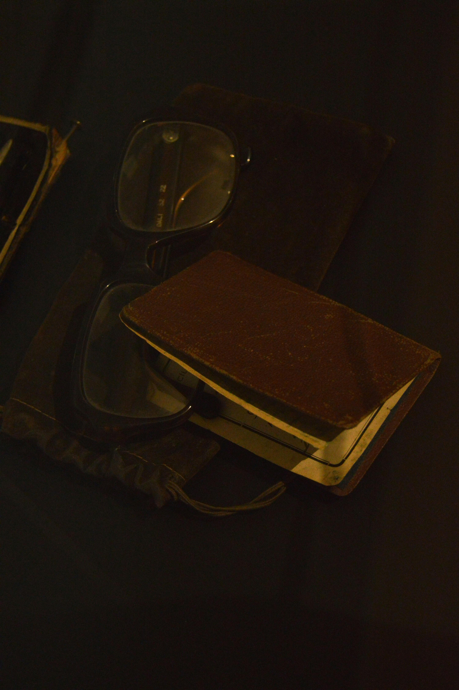
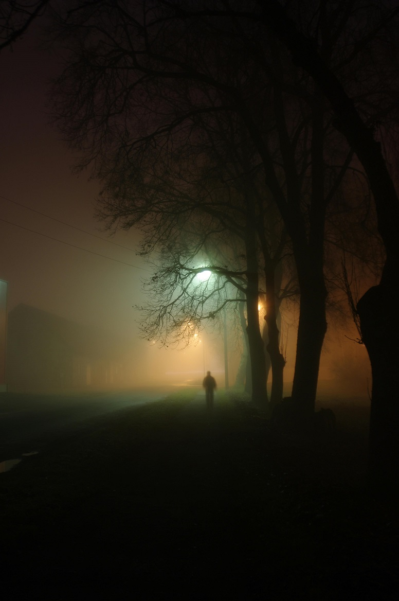
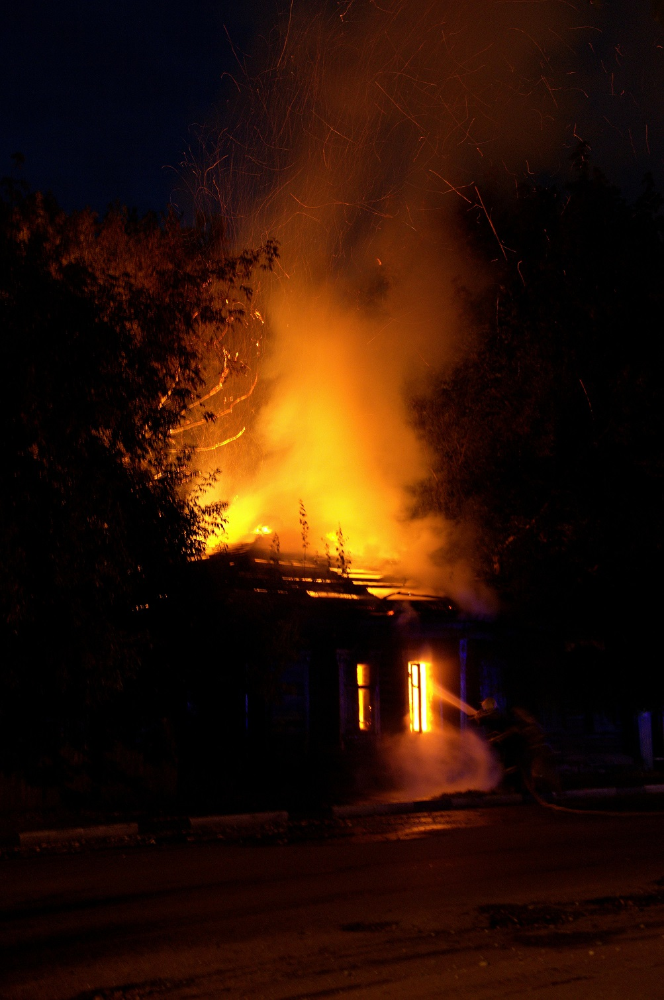

## The Old Man

Erwin, 78. Still in relatively good shape for his age. A few episodes every now and then, but you should be able to manage easily. He is otherwise very sociable and doesn't say much.

It was Ingrid's first day working at the elderly home. She was nervous and scared of doing anything wrong. She carried around a little notepad and a pen and wrote short notes to each person living here. Her blonde hair was up to a bun and despite her being a nurse and carer, she wore casual clothing. As this was a residence for elderly people to live in, they shouldn’t feel like it was a hospital. Nicky, her shift manager, introduced her to all the residents. Erwin was last on the list and Nicky continued to educate Ingrid about the evening and morning routines.

Erwin sat motionless on his bed, staring at the wall on the opposite side. The room was simple, pretty and tastefully decorated, but it was not a home. It was a nursing home where he had lived for two and a half years.

Von Bin im Garten - Selbst fotografiert, CC BY-SA 3.0, https://commons.wikimedia.org/w/index.php?curid=13899086

Erwin still had full hair. It had gotten thinner over the years. He used to be blonde but now his hair was fully white. He was dressed very well, even though he lived in this institution. Sometimes the nurses would ask him who he would dress up for and he would make up new people every time. They would laugh, he would smile and then go on with his day.

Erwins children had moved away and he saw them maybe twice a year. His son had a daughter last year whom he hadn't met yet. Maybe this fall. Maybe this time they would all come and see him.
His headache today was unbearable. He clutched his temples and let a deep sigh escape from his chest. The headache was always there, but this afternoon, it was particularly bad. It felt like a worm was crawling through his brain feeding from it.

Before Erwin went to the nursing home, he lived on a nice, well-kept street just outside the city. His uncle had the house built in the post-war period and when he died, Erwin inherited it. He lived there with his wife Hedwig his entire life after his inheritance. She died 8 years ago and Erwin was alone. His son provided him with everything important during that time, but Erwin was getting older, his son's time was running out and when a career change came up, everyone, except Erwin, decided that it was time for him to go to a nursing home. The house was put up for sale and the proceeds paid for the nursing home.
However, in these two and a half years the house was resold three times. Erwin smiled at the thought of it. No one was happy in this house except him.

The door opened and Ingrid - the new nursing assistant - was standing in the room with a tray.

Hello Erwin, I'm Ingrid and today is my first day. I've put together some cake and coffee for your afternoon coffee. Should I leave it here on the table for you?

She looked over at the small square wooden table that could barely fit two people. On it was a small crocheted doily with flowers in a vase in the middle.
Erwin looked at Ingrid, then at the table and nodded.

All right Erwin, then I'll put it here and pick up the dishes again at five. Dinner is at six.

Erwin nodded again.
While Ingrid left the room, Erwin's gaze went back to the wall. Where it had been for the last two hours. The pattern of the textured woodchip wallpaper swirled before his eyes, forming relief-like images and sometimes even text. He had noticed it for the first time three months ago and since then he had been staring obsessively at the wall and what it had to say to him.
Erwin reached next to him and picked up his leather-bound notebook, in which he sketched every picture and wrote every word he looked at. What did they mean?
He looked down at his notebook.

> The world made from obsidian appears cold and strange, yet forged from the fire of all life, it represents just a moment of its existence. Whether you burn or cut yourself will only be decided by how many times you blinked your eyes before you took the first step.

He watched as the wet ink slowly soaked into the paper and the paper fibers absorbed the ink like dark rays of sunlight, diverting it from its predetermined path.

_A world made of obsidian?_

Photo by Büşra   : https://www.pexels.com/photo/eyeglasses-and-a-vintage-book-18318319/

Erwin flipped through the pages and sketched a landscape in quick and hectic strokes. A scorching sun, jagged and smoking mountains. No trees, no plants, no animals. Almost as if it was another planet.
He rubbed his eyes now; staring at the wall had made them tired and they were sore. When he turned to the table he saw the cake on the plate, but what he saw there was not appetizing. Maggots slowly crawled to the edge of the plate. They fell down and landed on the tabletop with soft audible “pops”.

Erwin stood up and looked at the coffee. It was moldy and dried out, as if it had been sitting there for weeks.

He squeezed his eyes and shook his head.

No, no, no

he whispered to himself. When he opened his eyes again the image had changed. A freshly cut piece of cake lay on a clean, neutral white plate. The coffee next to it steamed invitingly and its scent filled the room, a scent that brought back memories of the time Hedwig woke him up with fresh coffee. The times when he worked the late shift as a miner. Every lunchtime Hedwig sat by his side on the shared bed holding two cups of coffee. One for him and one for her. They sipped their coffee together in bed and talked about everything and nothing.

Erwin sat down and began to eat the cake slowly, savoring each bite and washing it down with the warm coffee.

Hedwig, neither the coffee nor the cake here can compare to what you always made for me.

I know. I'm sorry.

that was the response in his head and Erwin smiled.

It's not your fault. They're just not as good as you here.

It was only the afternoon, but it was already getting dark. The days were growing shorter and winter’s darkness was slowly approaching. The leaves had already completely fallen from the trees and Erwin thought he could smell the first snow.

Even though he lived in a nursing home, he was allowed to move about freely. Even though he was advised not to leave the property without a carer assigned to him. However, he never took advantage of it, as it required navigating unbearable bureaucracy. Nurses had to be booked a week in advance.
Erwin wanted to enjoy the autumn air without some young brat running next to him and trying to make conversation in baby talk.

Erwin changed from his felt slippers into his leather shoes, which he had had for 30 years. He had them repaired time and again. He hated throwing things away or having to replace them. Hedwig had chosen them for him long ago, and he could never part with them.
His coat hung on a hook by the bedroom door, with his hat right beside it. He grabbed both, got dressed and left the room. He walked quickly through the hallway out of the large glass door.
He took a deep breath. The melancholic smell of rotting leaves was probably something he never got used to, no matter how old he was.

Erwin, we have to hold the front.

A boy's voice, almost childlike, shouted in his ear. 
No, we don't have to.

Erwin took another deep breath before stepping out of the iron gates and slowly walked down the street. The sidewalk was wet and the lights of the street lamps and traffic lights were reflected in the puddles and leftover water on the concrete slabs. A few cars passed him and the sound of tires on wet asphalt was unbearably loud. “Scriiiiitch”. Every time another car drove past him. “Scriiiiitch”.
The world had grown louder-not with people but machines. People, meanwhile, had grown quieter. Except for the voices in his head. They had never quieted.

Erwin reached the bus stop and looked at his watch. Ten minutes until the last bus came through the city. The town was small, this bus route ran in circles, once around the entire town. Colloquially it was called the Circle bus or simply Circle short. The bus was always crowded, especially at closing time. But Erwin didn't care. He wanted to take this bus.

Photo by Scott Webb: https://www.pexels.com/photo/timelapse-photo-of-bus-stop-136739/

The closer it got to departure time, the more people joined him at the bus stop. A woman with shopping bags. A boy with headphones blaring music. A young girl in work clothes leaned against the bus shelter, engrossed in a book.

When the bus finally arrived, people boarded slowly, unhurriedly. It was indeed a full bus. Erwin showed his ticket to the bus driver and slowly walked through the bus looking for a seat.

Oh, young man, don’t worry. I’m getting off at the next stop anyway. Please, take my seat.

A middle-aged woman with curly brunette hair, a round, friendly face, and a bright smile looked at Erwin.
Erwin nodded at her. 

Thank you very much

he said. 

 Oh, not at all. I’d never forgive myself if you had to stand and maybe fall or hurt yourself.

She squeezed out of the narrow row of seats past Erwin and he slowly slid to the window seat that had been vacated.

The bus driver looked in the rearview mirror and when he saw that everyone was as comfortable as possible, he continued the drive.

The next stop came and the nice woman waved to Erwin.

 Bye and have a nice evening young man.

Erwin smiled and nodded at her again. He was not a man of many words or loud words. He felt a little uncomfortable being addressed as “Young man”. The bus continued its journey. A man carrying a huge bouquet of roses got in and sat down in a four-person seat in front of him. He looked nervous, checking his watch. He was sweating like he had to run to catch the bus.

More and more people entered, barely anyone left. At the next stop some teenagers got on, they were joking around, teasing each other, pushing each other until one of the children stumbled backwards into the man with the roses. He tried to shield the bouquet with his other arm, but the girl fell directly on it. The other kids laughed and the girl apologized with guilt in her voice and then turned around and shoved her friend who had gotten her into this situation back into the seat and hissed.

Maaaan, what was that about? I could have hurt myself. Man you are so embarrassing.
 
BEHAVE YOURSELVES BACK THERE OR YOU WILL GET KICKED OFF

the bus driver finally shouted through the speakers. It was already quiet on the bus. It was as peaceful and quiet as it could be on a crowded bus. The next stop was the train station. Erwin had to go three more stops.

Again a lot of people got on, but this time also a lot of people got off. However, there were not enough seats.

Erwin, we're going to die here. You and me. You know that, don’t you?

The boy's voice echoed in his head again. 

No, we won't. I am with you and you are with me and we take care of each other.

Erwin whispered in response.
Some people on the bus looked at him, but then quickly looked away. 

I don't know. We are all alone here Erwin. They're not coming back for us. I don't believe it.

The voice in Erwin's head sounded desperate and as if it had already given up. 

We will get through this. And I know this because it has already happened.

Erwin replied again.

The bus ride continued and a girl sat down next to the man with the rose. She looked Erwin straight in the face. She didn't look embarrassed like the others, but rather interested. Her look felt painful. Not physically, but it was uncomfortable.

Erwin quickly looked away, but the voices in his head suddenly took over.

ERWIN they are coming. I hear them. We have to defend ourselves now or we die.
 

Shoot at nine o'clock!
 

Got it!

Erwin heard screaming. He heard shots. But he still heard the enemy troops as well.

Shoot!

Then he saw a little boy running through the field, crying.

Don't shoot!

His comrade turned around, looked at Erwin and got hit at that exact moment. He fell to the ground.

Don't leave me behind

Erwin almost cried. The little boy in the field transformed suddenly into a soldier. He aimed at Erwin and fired. Erwin automatically held his leg and whined.

He rubbed his eyes. He was still on the bus and some passengers were staring at him. The girl across from him continued to stare, her expression now pitying.

Erwin wiped the tears from his face and stared at the ground.

The bus stopped and many passengers got off, including the girl. The next stop should be his.
The five-minute bus ride stretched endlessly, feeling more like an hour. Erwin was freezing and so he pulled his coat a little tighter. It was warm in the bus, that wasn't the problem. But he felt cold, as if the chill of a wet and muddy winter grave was seeping into each and every of his bones. His joints started aching.

At the next stop he left the bus with almost desperate haste. He stood on a dark, nearly deserted street. The street lights flickered, moths were flying frantically around the glow, and wet leaves made the sidewalk slippery. Erwin slowly walked down the street.

Photo by Liana Laur: https://www.pexels.com/photo/mysterious-foggy-street-at-night-with-silhouette-29494279/

Thank you, for doing this Erwin.

Hedwig's voice thanked him in his mind.

I'm scared, Hedwig.

I know.

Erwin shuffled along the sidewalk, the houses growing sparser until he turned onto a narrow forest path.
After seven and a half more minutes he finally reached his destination. Hedwig and his old house. It was empty; it had just been sold again, but the new owner had a medical emergency shortly after purchasing it and was now in the hospital. So it was empty for the time being.

It was an old building, two floors. Once painted cream, it had been a bold dark red during his time there. The attic had been converted and picturesque, small windows peeked out between the roof tiles.
The shutters had been removed in a desperate attempt to make the house look more modern and upscaled. The paint and plaster were peeling off in some places.

Erwin looked around the garden.

The apple tree in the front corner of the garden stood bare, its fruits and leaves long gone. The swings his children once played on were gone, but Erwin could still hear their laughter and the faint squeak of the chains in his mind.

He walked up the path to the front door. The entire house was dark. Although he didn't have a key, he knew where a spare key was hidden. If luck was on his side, these locks hadn’t been changed. Erwin looked under a mossy rock next to the porch and found a small plastic container underneath. He opened it carefully and inside were two slightly rusty keys.

He took one key and slowly walked the four steps to the front door. He put the key in the lock and turned it carefully. Click. The lock gave way while echoing it in the silence of the empty rooms.
Erwin breathed a sigh of relief and entered the hall.

The house was empty. The floors changed - now polished exposed wood. Hedwig wouldn't have liked that. The sound of every footstep being heard everywhere in the house would have driven her crazy. He closed the door behind him and walked slowly through the darkness that merely exposed shapes but not a complete picture. Each and every step made on the wooden planks released a crack and creak.

Photo by Nandhu Grafix Photography: https://www.pexels.com/photo/photo-of-old-lamp-10823165/

Erwin knew exactly where he wanted to go. The cellar door and the cellar stairs were right in front of him. He slowly continued down the hallway until he reached the old wooden door. It hadn't been switched out either. But it was painted white. He opened the door to the basement steps. His old oil lamp still hung by the door. What an odd thing to keep in these modern times. But he wasnt mad about it. He took it and lit it. A frantic flame ignited and danced around. His eyes slowly adjusted to the light as he walked down the stairs, which only consisted of roughly assembled planks. The basement was barren. Once filled with supplies, preserved food, canned goods, and his workbench down here, the basement was now empty.
But Erwin knew why he was here; it was neither of the former things.

He purposefully went to the corner of the small, dim basement room. The walls of the basement were covered with stagnant water stains. The mortar between the bricks was crumbling in some places. Erwin went to a particular brick in the wall and carefully but deliberately removed it. It was loose despite not looking like it. Erwin’s little secret.

With his wrinkled and thin hand he reached into the opening behind the stone. He felt something cold and dusty. He grabbed it with his shaky fingers and a metallic scraping sound was heard as he retrieved the object from its hiding place.

It was an old metal box. Rust had spread across some sides and the dents and scratches were witnesses of time and wear. Erwin had it with him during the war. He kept important things in it that he didn't want damaged. After the war it continued to guard his most precious items.
His trembling hands carefully opened it and the sharp creaking of the hinges pierced through the otherwise silent basement. Tears formed in Erwin's eyes when he saw the contents. He hadn’t seen these things in a very long time..

Look Erwin, we were happy

he heard Hedwig say. He saw the corner of the wedding picture of the two among the numerous objects in the box. He carefully pulled it out from underneath and looked at it. Hedwig, a radiant young beauty and himself, worn by the war, yet managing to pose with a strained smile.

When you came back from the war, Erwin, that was my happiest moment. All these years worrying whether I would see you again. Worried about whether you would see me again. It was a miracle that we found each other.

I know Hedwig. But without you, none of this would have made any sense. I set this all up for you.

Erwin, but now it's time to let go, it's time for you to accept the past as such.

Why let go Hedwig, I hear you speaking to me. You are here. I just can't see you. But we talk every day and you tell me how much you miss me. Why should I let go of the only thing in the world that still keeps you with me.

Erwin, you've always had nonsense on your mind. But this is your biggest nonsense.

What are you talking about Hedwig.

Erwin, I've been dead - for years. I'm not here and you know that. You're far too smart for that.

Erwin lowered the photo in his hand. It slipped from his fingers. She was right. The voice that was Hedwig, or pretended to be, she was right.

His hands went through the box. Locks of hair from his children, his grandchildren. And his friend's soldier’s ID tag from the war.

Erwin… 

he suddenly heard his voice. 

What do you want?

Erwin replied through gritted teeth. 

You finally have to let go, Erwin. This has gone too far - Far beyond reason. You lost people, you were hurt. But you don't have to hurt others too. You're not the person to do something like that.
 

WHAT are you talking about? I didn't do anything wrong.

Erwin sobbed, hurt by the accusations. He dropped the tin box and it landed with a loud clatter on the concrete floor. The contents - photos, letters, locks of hair and pendants - scattered around the box, which now had another dent.

He held his hands to his face and cried. The tears ran through his fingers, down his cheeks. All the pent-up pain and repressed emotions came flooding back. Among the things on the floor that were in the box, was a small bundle of dried twigs. A purple ribbon wrapped around it. Erwin bent down and carefully took it in his hand. An acquaintance had given it to him when Hedwig died. Her words:

If you keep these plants with something that reminds you of them, they will always stay with you.

Erwin saw it as a nice gesture and had put it next to Hedwig's photos first. But as he slowly put some of her things away, he had put the dried plants in that bundle in that box along with all the other memories.
He stared at the bundle and suddenly a clarity came through his mind that he had missed in recent years. At first he had only heard Hedwig, but it got worse after he put her things away. After that bundle ended up in a box with the remnants of past relationships and friendships.

I'm so sorry for keeping you here.

he whispered. 

We're sorry too.

they both said in an eerily merged voice almost synchronized. 

I'm ending this - now!

Erwin took the bundle of herbs and lit it on the oil lamp.
There were things that Erwin had expected to happen: but then there were the things that actually happened.
What Erwin had expected: that the little bundle would catch fire and then char with a small flame and leave nothing behind. That he would crumble it in his hands and everything would finally be over. That he could go home and forget everything.

However, what actually happened was far from that idea: the moment the herbs caught fire, sounds that these plants could never have caused came from his hand. They hissed and sizzled and while the sound started quietly, the volume and power behind it increased as the flame grew larger and larger.

Erwin threw the bundle to the ground, paralyzed by the terror he saw unfolding. The flame didn't become smaller, but bigger and slowly began to eat away at the contents of the tin box and even the box itself. In an unnatural way, the various objects were immediately on fire, whether flammable or not. Each new burning object gave the flame a new color.

Then came the screams. He heard Hedwig screaming as if she was in the worst pain known to mankind. His soldier friend joined in the cries of pain. The two screamed, cried, and called his name.

Erwin dropped the oil lamp next to him and held his head with both hands.

Stop screaming

he now shouted himself. But the voices only grew louder.
Erwin collapsed against the wall behind him sobbing in despair.
The flames had now reached the wooden stairs and in just a few seconds the old wood was ablaze. Erwin's only way out was cut off and he was surrounded by demonic flames that mockingly danced around him.
Erwin looked up as the heat became more unbearable and realized there was no way out. His crying stopped, his screaming stopped, and the voices stopped.

A figure appeared within the flames. No, that wasn’t it. The flames encircled the figure. No, they _formed_ the figure. And he recognized the outlines. He would have recognized the outlines in his sleep. Erwin stood up and approached the flaming figure. She kept her arms open and outstretched and looked wordlessly in Erwin's direction.

Here I am Hedwig.

Erwin approached the figure, arms trembling, and embraced it as if it were the only truth left in the world.

Ingrid entered Erwin's room to collect his plate. She had intended to do this earlier, but it was her first day. The tight routines had left her struggling to keep up. Tomorrow it would definitely be faster.
She had knocked carefully in case Mr. Erwin was already asleep. When no one answered, she first hesitated but then slowly opened the door. The room was empty.

She looked around and the shoes and jacket were also gone. She saw a small notebook lying on the bed. She skipped through the pages nervously. When she got to the last page she read the last sentence.

> Whether you burn or cut yourself will only be decided by how many times you blinked your eyes before you took the first step.

Ingrid ran to reception to call the emergencies.

Photo by Andrey Karpov: https://www.pexels.com/photo/house-on-fire-5687983/

  
